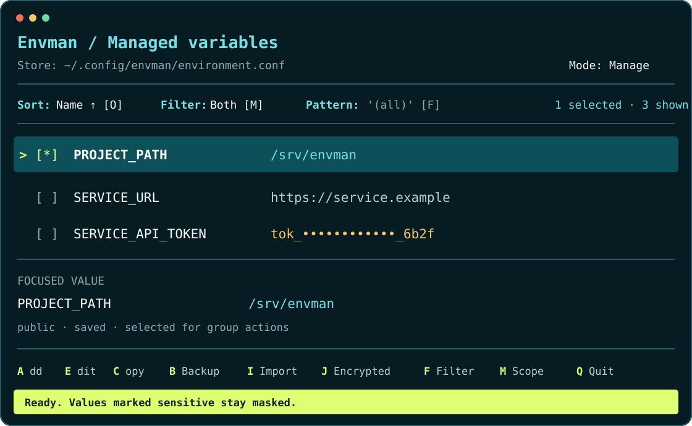

<p align="center">
  <picture>
    <source media="(prefers-color-scheme: dark)" srcset="docs/assets/logo-dark.svg">
    <source media="(prefers-color-scheme: light)" srcset="docs/assets/logo-light.svg">
    
  </picture>
</p>

# Envman

[](https://github.com/CruxExperts/envman/actions/workflows/ci.yml)
[](https://github.com/CruxExperts/envman/actions/workflows/codeql.yml)
[](https://cruxexperts.github.io/envman/)

**Version:** 0.1.9

Envman manages durable, per-user environment variables on Linux. Use the terminal UI for deliberate local edits or the CLI for repeatable commands and JSON output. Values live in one managed location, so shell startup files stay readable.

> [!IMPORTANT]
> Release installation currently supports Linux x86_64, CPython `>=3.12,<3.13`, and `uv >=0.11`.

## Install and open

The release installer verifies immutable asset URLs, sizes, SHA-256 hashes, wheel metadata, runtime constraints, and the local host before installing the wheel.

```bash
uv run --python 3.12 --script \
  https://github.com/CruxExperts/envman/releases/latest/download/install.py

export PATH="$(uv tool dir --bin):$PATH"
envman
```

A new store starts empty. Press `A` to add the first variable. Press `Q` or `Esc` when you are ready to leave the catalog and start a child shell with the managed environment.



## Why Envman

- The TUI and CLI use the same validation, masking, and persistence rules.
- Values classified as sensitive by their names, plus password-bearing URLs, stay masked in ordinary output.
- Imports show a preview before `--apply` writes any change.
- New saves encrypt the managed configuration with a separate private storage key.
- Encrypted exports use an independent backup credential.
- Updates follow the verified provider recorded in the installation receipt.

Envman is a local operator tool. It does not provide hosted sync, team access control, remote secret storage, or a replacement for an operating-system credential store.

## Use the interface that fits the job

| Terminal UI | Scriptable CLI |
| --- | --- |
| `Up` and `Down` move focus. `Space` builds a selection. | `envman list --json` returns stable machine-readable output. |
| `A`, `Enter`, and `R` add, edit, and rename. | `set`, `unset`, and `rename` make explicit changes. |
| `I` and `J` preview process or encrypted-backup imports. | Import commands preview first and require `--apply` to save. |
| `B` backs up selected variables, or the full set when none are selected. | `export` writes an authenticated encrypted JSON backup. |

Common CLI commands:

```bash
envman set PROJECT_URL --value https://example.test
envman get PROJECT_URL
envman list --json
envman validate API_TOKEN --stdin
envman check --json
```

Use `--stdin` for values that should not appear in shell history. Use `envman --nocolor` when the terminal cannot use curses color pairs.

## Storage and masking

Envman stores assignments under `${XDG_CONFIG_HOME:-$HOME/.config}/envman/`. The first save creates a separate random storage key under `${XDG_STATE_HOME:-$HOME/.local/state}/envman/storage.key` and encrypts the managed configuration. Automatic environment snapshots created after that save contain ciphertext.

Anyone who obtains both the storage key and encrypted file can recover the values. An unlocked user or root can also read values from the running environment. The [storage and shell-loading reference](docs/reference/storage-and-shell-loading.md) documents the full boundary and plaintext-snapshot migration.

Encrypted backup files use `ENVMAN_BACKUP_KEY` when it is configured. Otherwise Envman can use a private fallback key, but only after explicit approval:

```bash
envman key --generate --approve-key-generation
envman export backup.json
envman import-backup backup.json --all --apply
```

The command never prints key material. `--yes` and `--force` do not approve key generation. Keep keys, managed values, receipts, and backup files out of source control.

<details>
<summary>Install the optional agent skill</summary>

Releases that include the Envman agent skill can install it globally or for a repository. Automatic placement uses the shared `.agents/skills` root and also refreshes existing LocalSetup-supported native roots:

```bash
uv run --python 3.12 --script \
  https://github.com/CruxExperts/envman/releases/latest/download/install.py \
  --install-skill --skill-scope global

uv run --python 3.12 --script \
  https://github.com/CruxExperts/envman/releases/latest/download/install.py \
  --install-skill --skill-scope repository --skill-target opencode
```

Use `--skill-target all` for every LocalSetup 5.6.2 write shape, or repeat `--skill-target AGENT` for selected agents. The installed updater can refresh the skill from Envman's latest verified GitHub release even when the tool version is already current:

```bash
envman update --install-skill --skill-scope global --skill-target codex
```

The installer refuses symlink escapes and preserves an unmarked existing skill. See the [installation guide](docs/getting-started/installation.md) for all 20 target names and recognized roots.

</details>

## Documentation

- [Install and update Envman](docs/getting-started/installation.md)
- [Use the terminal UI](docs/guides/tui.md)
- [Automate with the CLI](docs/guides/cli.md)
- [Create and restore encrypted backups](docs/guides/backups-and-migration.md)
- [Understand storage and shell loading](docs/reference/storage-and-shell-loading.md)
- [Inspect the release and update trust boundary](docs/reference/install-source-and-updates.md)
- [Read the architecture](docs/development/architecture.md)
- [Run the test suite](docs/development/testing.md)
- [Open the GitHub Pages documentation](https://cruxexperts.github.io/envman/)

## Support and contributions

Ask usage questions in [GitHub Discussions](https://github.com/CruxExperts/envman/discussions). Report reproducible defects in [GitHub Issues](https://github.com/CruxExperts/envman/issues). Suspected vulnerabilities belong in [private vulnerability reporting](https://github.com/CruxExperts/envman/security/advisories/new), never a public issue.

Contributors should read [CONTRIBUTING.md](CONTRIBUTING.md), [SECURITY.md](SECURITY.md), and the [Code of conduct](CODE_OF_CONDUCT.md). Envman is released under the [MIT License](LICENSE).
