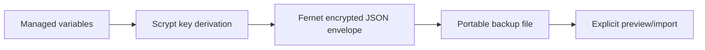

# Encrypted backups and migration

Set `ENVMAN_BACKUP_KEY` in the process environment before exporting or importing. Envman derives an encryption key with Scrypt, encrypts the variable mapping with Fernet, and writes an authenticated JSON envelope. The backup password is never written into the envelope.

```bash
export ENVMAN_BACKUP_KEY='use-a-strong-secret'
envman export envman-backup.json
envman import-backup envman-backup.json --all --apply
```

Backups are intentionally explicit: inspect a preview first, then select names or `--all --apply`. Keep the password outside source control and transfer the encrypted file through an appropriate channel.



An import rejects malformed JSON, unsafe paths, incorrect passwords, unauthenticated data, invalid names, and protected collisions unless `--replace` is supplied.
