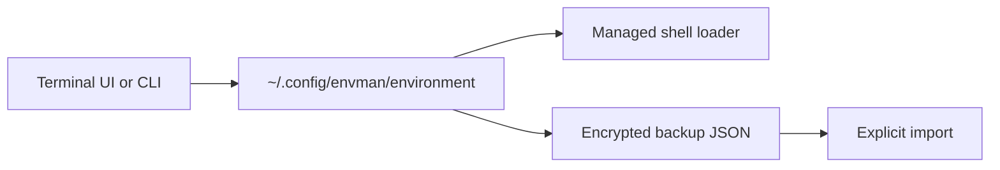

<section class="hero" aria-labelledby="hero-title">
  <div class="hero-copy">
    <p class="status">machine state: manageable</p>
    <h1 id="hero-title">Your environment variables are scattered. Envman makes them portable.</h1>
    <p>Keep per-user variables in one durable file, work through a terminal UI or a scriptable CLI, and move them between machines with encrypted backups.</p>
    <div class="actions" aria-label="Primary actions">
      <a class="button" href="{{ '/getting-started/installation' | relative_url }}">Install 0.1.0</a>
      <a class="button secondary" href="{{ '/guides/cli' | relative_url }}">CLI reference</a>
      <a class="button secondary" href="https://github.com/CruxExperts/envman">GitHub</a>
    </div>
  </div>
  <section class="panel" aria-label="Illustrative Envman terminal interface">
    <div class="panel-header"><span>envman / catalog</span><span class="signal">encrypted backups ready</span></div>
    <pre class="readout" aria-label="Illustrative output"><span class="status">healthy</span>
OMNIROUTE_BASE_URL  https://llm.example/v1
OMNIROUTE_API_KEY   &lt;masked&gt;
PROJECT_PATH        /srv/project

[Enter] edit  [E] export  [I] import  [Q] quit</pre>
  </section>
</section>

## One managed source, two ways to work

<div class="columns">
  <section>
    <h3>Terminal UI</h3>
    <p>Browse, filter, edit, import, and validate persistent variables without hand-editing shell files.</p>
  </section>
  <section>
    <h3>Scriptable CLI</h3>
    <p>Use structured JSON output for automation, with masking and validation applied by default.</p>
  </section>
  <section>
    <h3>Encrypted migration</h3>
    <p>Export an authenticated encrypted envelope and import it on another machine with the same backup key.</p>
  </section>
</div>

## Start with a verified release

```bash
uv run --python 3.12 --script https://github.com/CruxExperts/envman/releases/latest/download/install.py
envman
```

Envman release installation verifies a GitHub release manifest, wheel metadata, asset hashes, and a pinned runtime constraints projection before calling `uv tool install`. [Read the installation and update trust boundary.]({{ '/reference/install-source-and-updates' | relative_url }})

## What Envman keeps where



- [Install Envman]({{ '/getting-started/installation' | relative_url }})
- [Use the terminal UI]({{ '/guides/tui' | relative_url }})
- [Automate with the CLI]({{ '/guides/cli' | relative_url }})
- [Understand storage and shell loading]({{ '/reference/storage-and-shell-loading' | relative_url }})
