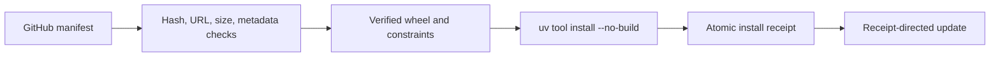

# Installation sources and updates

The public installer is a PEP 723 `uv --script` file with no third-party runtime dependencies. It downloads a bounded `release-manifest.json` from the latest GitHub release, requires the `CruxExperts/envman` repository and an exact `vVERSION` asset URL, verifies hashes and sizes, inspects wheel metadata without extracting the wheel, and installs only a verified local wheel.

## Trust boundary

The installer trusts:

1. The locally invoked `uv` executable and its selected CPython 3.12 runtime.
2. GitHub release hosting and GitHub-controlled redirect hosts for the signed-by-hash release assets.
3. PyPI over TLS for exact runtime wheels resolved by the verified `runtime-constraints.txt` projection. `--no-build` forbids source builds.

It does not claim a hermetic dependency install. It accepts only Linux x86_64, CPython `>=3.12,<3.13`, and `uv >=0.11,<0.12`.

## Receipt-directed updates

After a verified install, Envman writes a mode-`0600` atomic receipt under `${XDG_STATE_HOME:-$HOME/.local/state}/envman/install.json`. `envman update` dispatches only through that receipt provider. It rejects downgrade manifests, avoids reinstalling the same version, prefetches prior artifacts for replacement, and restores the prior tool/receipt on a failed verified update.

